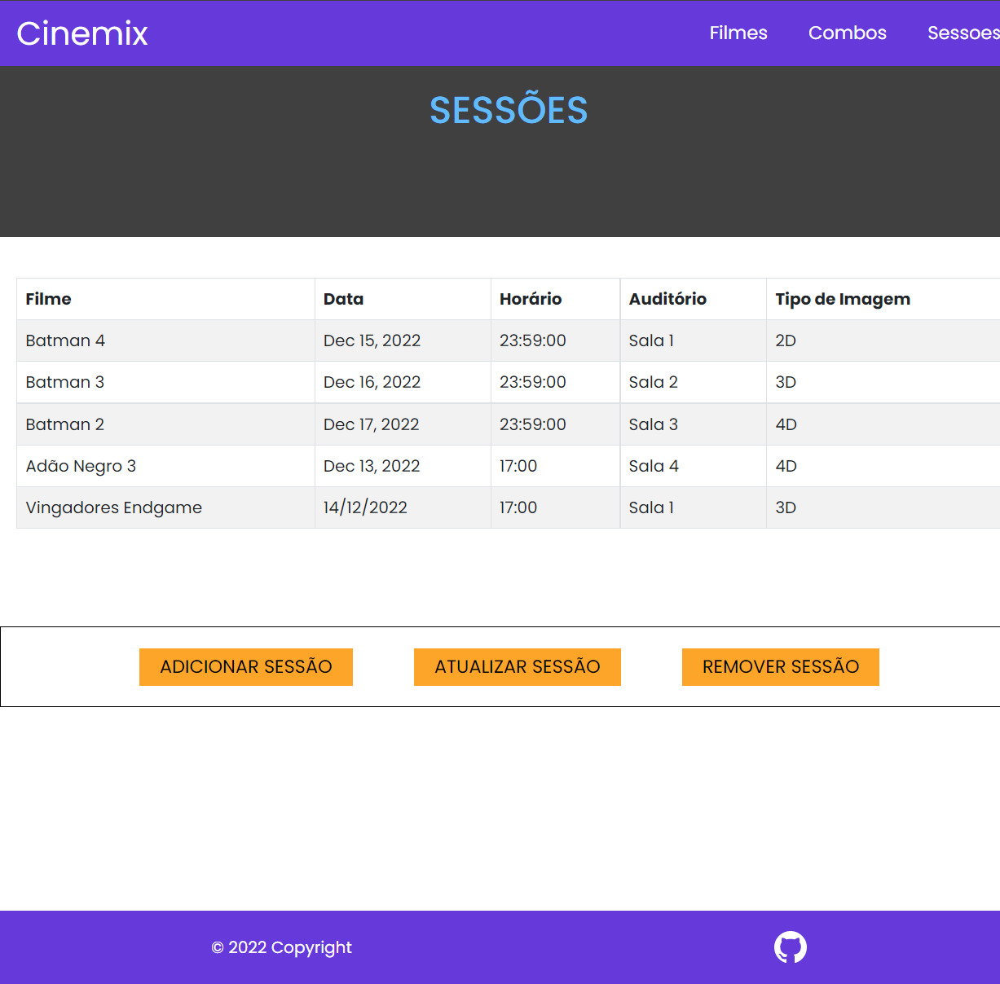

# Módulo 3 – Sendo Servido

<br>

<h1 align="center">
  
</h1>

<br>

 #### Cinemix se baseia em uma plataforma de cinema que simula o lado do administrador onde o mesmo poderá realizar os métodos:

 - GET = <i>Listar</i>
 - POST = <i>Adicionar</i>
 - PUT = <i>Editar</i>
 - DELETE = <i>Excluir</i>

 ## Recursos
>O sistema possui recursos para cadastrar, atualizar e remover filmes, combos e sessões.

 <br>

## Tema da API
>CINEMA

Descrição:
>Criar um site utilizando o json.server.
O projeto deverá ser construído usando o framework React
aprendido em aula, nele iremos desenvolver um site que
deverá utilizar um servidor Json construído anteriormente.
Este projeto deverá seguir um tema dos utilizados pelos
integrantes no projeto 1.

<br>


## Dependências
[Node.js](https://nodejs.org/en/)

[Json-Server](https://github.com/typicode/json-server) para o fake database em json.

[Concurrently](https://www.npmjs.com/package/concurrently) executa vários comandos simultaneamente como `npm run dev & json-server`
>Exemplo: `"start": "concurrently \"npm run dev\" \"json-server --watch db.json\""`

[React-Bootstrap](https://react-bootstrap.github.io/) O modelo de componente React nos dá mais controle sobre a forma e a função de cada componente.

[Axios](https://axios-http.com/ptbr/) Axios é um cliente HTTP baseado em promessas para o node.js e para o navegador

[React-router-dom](https://reactrouter.com/en/main) O React Router permite roteamento do lado do cliente

<br>

## Uso

Clone o projeto

```bash
  git clone https://github.com/nobrupsiq/projeto-grupo-md3
```

Entre no diretório do projeto

```bash
  cd projeto-grupo-md3
```
Instale as dependências
```bash
npm install
```
Inicie o servidor
```bash
npm start
```
<br>


## ✔ Stack utilizada

- **Front-end:** React, Bootstrap

- **Back-end:** Node, Json-Server

<br>

## Documentação de cores


| Cor               | Hexadecimal                                                |
| ----------------- | ---------------------------------------------------------------- |
| Purple |   #6639DA |
|  Blue |  #61BAFC |
|  Orange       |  #FDA529 |
|  Gray 1       |  #C2C4D1 |
|  Gray 2       |  #404040 |
|  Black      |  #000000 |
|  White       |  #ffffff |

## Screenshots




<br>

## Feedback

Se você tiver algum feedback, por favor nos deixe saber por meio de siqueiracode@gmail.com
